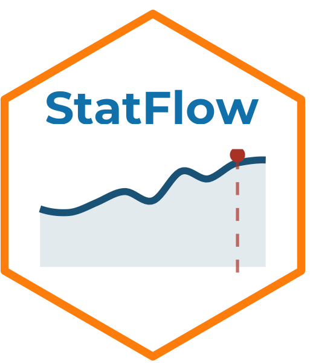

# StatFlow 

> Herramienta interactiva de análisis estadístico y visualización de datos
> para usuarios sin experiencia en programación ni estadística.

Parte de la suite **StatSuite**:

| App | Descripción | Estado |
|-----|-------------|--------|
| **StatFlow** | Primeros análisis y visualización de datos | ✅ Disponible |
| [StatDesign](https://github.com/ManuelSpinola/StatDesign) | Diseño de estudios y muestreo | ✅ Disponible |
| StatModels | Modelos estadísticos avanzados | 🔜 Próximamente |

## Estructura del proyecto

```
StatFlow/
├── app.R
├── DESCRIPTION
├── R/
│   └── helpers.R
└── modules/
    ├── mod_datos.R
    ├── mod_explorar.R
    ├── mod_graficos.R
    ├── mod_medias.R
    ├── mod_frecuencias.R
    └── mod_ayuda.R
```

## Instalación local

```r
install.packages(c(
  "shiny", "bslib", "bsicons", "tidyverse",
  "readxl", "DT", "scales",
  "parameters", "performance", "effectsize",
  "bayestestR", "datawizard", "insight"
))
shiny::runApp()
```

## Autor

**Manuel Spínola**  
ICOMVIS · Universidad Nacional · Costa Rica

## Licencia

MIT
