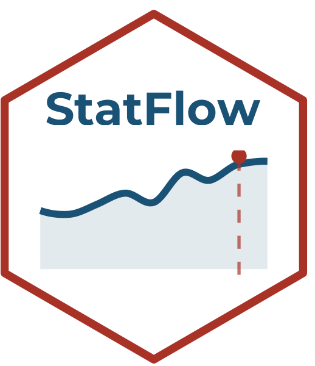

# StatFlow 

**StatFlow** es una plataforma interactiva para análisis exploratorio de datos, parte del ecosistema [StatSuite](https://github.com/ManuelSpinola). Diseñada como punto de entrada al análisis de datos en ecología y ciencias de la biodiversidad.

## Módulos disponibles

| Módulo | Descripción |
|--------|-------------|
| Mis datos | Cargar y previsualizar datos propios |
| Explorar | Estadísticas descriptivas y resúmenes |
| Gráficos | Visualizaciones interactivas |
| Comparar medias | Pruebas t, ANOVA |
| Comparar frecuencias | Chi-cuadrado, tablas de contingencia |
| Correlación | Correlaciones y matrices |
| Valores de p | Interpretación de valores de p |
| Ayuda | Documentación y referencias |
| Acerca de | Información del proyecto |

## Instalación

```r
install.packages("remotes")
remotes::install_github("ManuelSpinola/StatFlow")
```

## Uso

```r
library(StatFlow)
StatFlow::run_app()
```

## Autor

**Manuel Spínola**  
ICOMVIS · Universidad Nacional · Costa Rica

## Licencia

MIT
